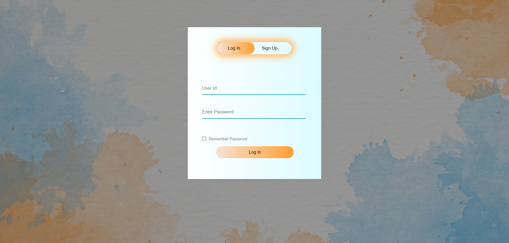

## Social-Networking

## A basic front end prototype of a social networking site. It a very basic practice based interactive site for understanding of Html and CSS. 

### http://

  

## Build With

- `HTML`
- `CSS`
- `Javasrcript`

## Features:

- Log in page that takes you to the home page.
- Enter into the HOME page of the site.
- Then explore a few basic layout of the site with few interactive elements. 
